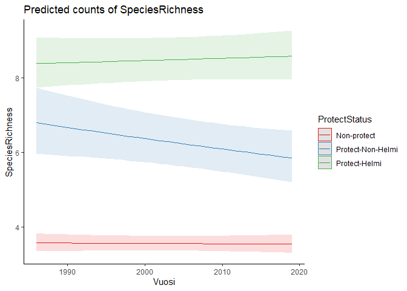

```r
library(glmmTMB)
library(ggplot2)
library(ggeffects)
library (MuMIn)
library(performance)
```


## The data

```r
mod.data = read.csv('data4model3_20241115.csv')
mod.data$NN = scale(mod.data$NNN)
mod.data$ProtectStatus = factor(mod.data$ProtectStatus, levels=c('Non-protect', 'Protect-Non-Helmi', 'Protect-Helmi'))
mod.data$SpeciesRichness = rowSums(1*(mod.data[,10:45] > 0), na.rm = TRUE)
mod.data$Hoito2020=mod.data$Hoito
mod.data$Hoito2020[which(mod.data$Hoito2020==1)]=1
mod.data$Hoito2020[which(mod.data$Hoito2020>=2)]=2
mod.data$Hoito20202=0
mod.data$Hoito20202[which(mod.data$Hoito2020>=1)]=1
```


## 1. Test whether the restored sites are in Helmi

```r
mod1 = glmmTMB(Hoito20202~ProtectStatus, 
               data=mod.data,family="binomial", REML=FALSE)
summary(mod1)
```

```
##  Family: binomial  ( logit )
## Formula:          Hoito20202 ~ ProtectStatus
## Data: mod.data
## 
##      AIC      BIC   logLik deviance df.resid 
##     2100     2120    -1047     2094     5768 
## 
## 
## Conditional model:
##                                Estimate Std. Error z value Pr(>|z|)    
## (Intercept)                     -6.6080     0.4475 -14.766  < 2e-16 ***
## ProtectStatusProtect-Non-Helmi   3.4882     0.4874   7.157 8.27e-13 ***
## ProtectStatusProtect-Helmi       7.2894     0.4511  16.160  < 2e-16 ***
## ---
## Signif. codes:  0 '***' 0.001 '**' 0.01 '*' 0.05 '.' 0.1 ' ' 1
```

```r
#r.squaredGLMM(mod1)

#plot - mod1
dat1 = ggpredict(mod1, terms = "ProtectStatus")
plot(dat1) + theme_classic()
```

<!-- -->

```r
#ggsave('restore_protect.png', dpi = 300)
```


## 2. Test the effect of protect status on waterbird abundance and population trends

```r
mod2=glmmTMB(TotalAbundance~
                 ProtectStatus*scale(Vuosi)+
                 poly(NN,2)+
                (1|SiteID), 
               data=mod.data,family = nbinom2, REML=FALSE)

summary(mod2)
```

```
##  Family: nbinom2  ( log )
## Formula:          
## TotalAbundance ~ ProtectStatus * scale(Vuosi) + poly(NN, 2) +      (1 | SiteID)
## Data: mod.data
## 
##      AIC      BIC   logLik deviance df.resid 
##  40042.2  40108.8 -20011.1  40022.2     5761 
## 
## Random effects:
## 
## Conditional model:
##  Groups Name        Variance Std.Dev.
##  SiteID (Intercept) 1.105    1.051   
## Number of obs: 5771, groups:  SiteID, 994
## 
## Dispersion parameter for nbinom2 family (): 7.22 
## 
## Conditional model:
##                                             Estimate Std. Error z value
## (Intercept)                                  1.99776    0.04585   43.57
## ProtectStatusProtect-Non-Helmi               1.14170    0.10224   11.17
## ProtectStatusProtect-Helmi                   1.65830    0.07869   21.07
## scale(Vuosi)                                -0.04362    0.01649   -2.65
## poly(NN, 2)1                                 8.55393    2.31341    3.70
## poly(NN, 2)2                                 0.36470    2.48777    0.15
## ProtectStatusProtect-Non-Helmi:scale(Vuosi) -0.10985    0.03403   -3.23
## ProtectStatusProtect-Helmi:scale(Vuosi)     -0.08189    0.02381   -3.44
##                                             Pr(>|z|)    
## (Intercept)                                  < 2e-16 ***
## ProtectStatusProtect-Non-Helmi               < 2e-16 ***
## ProtectStatusProtect-Helmi                   < 2e-16 ***
## scale(Vuosi)                                0.008159 ** 
## poly(NN, 2)1                                0.000218 ***
## poly(NN, 2)2                                0.883451    
## ProtectStatusProtect-Non-Helmi:scale(Vuosi) 0.001245 ** 
## ProtectStatusProtect-Helmi:scale(Vuosi)     0.000584 ***
## ---
## Signif. codes:  0 '***' 0.001 '**' 0.01 '*' 0.05 '.' 0.1 ' ' 1
```

```r
r.squaredGLMM(mod2)
```

```
##                 R2m       R2c
## delta     0.3052027 0.9078319
## lognormal 0.3073568 0.9142393
## trigamma  0.3027132 0.9004267
```

```r
check_collinearity(mod2)
```

```
## # Check for Multicollinearity
## 
## Low Correlation
## 
##                        Term  VIF   VIF 95% CI Increased SE Tolerance
##               ProtectStatus 1.05 [1.03, 1.09]         1.03      0.95
##                scale(Vuosi) 2.23 [2.14, 2.32]         1.49      0.45
##                 poly(NN, 2) 1.05 [1.03, 1.09]         1.03      0.95
##  ProtectStatus:scale(Vuosi) 2.23 [2.15, 2.33]         1.49      0.45
##  Tolerance 95% CI
##      [0.92, 0.97]
##      [0.43, 0.47]
##      [0.92, 0.97]
##      [0.43, 0.47]
```

```r
#plot - mod2
dat2 = ggpredict(mod2, terms = c("Vuosi[all]","ProtectStatus"))
plot(dat2) + theme_classic()
```

<!-- -->

```r
#species richness
mod22=glmmTMB(SpeciesRichness~
               ProtectStatus*scale(Vuosi)+
               poly(NN,2)+
               (1|SiteID), 
             data=mod.data,family = nbinom2, REML=FALSE)

summary(mod22)
```

```
##  Family: nbinom2  ( log )
## Formula:          
## SpeciesRichness ~ ProtectStatus * scale(Vuosi) + poly(NN, 2) +  
##     (1 | SiteID)
## Data: mod.data
## 
##      AIC      BIC   logLik deviance df.resid 
##  24707.8  24774.4 -12343.9  24687.8     5761 
## 
## Random effects:
## 
## Conditional model:
##  Groups Name        Variance Std.Dev.
##  SiteID (Intercept) 0.2577   0.5077  
## Number of obs: 5771, groups:  SiteID, 994
## 
## Dispersion parameter for nbinom2 family (): 6.79e+09 
## 
## Conditional model:
##                                              Estimate Std. Error z value
## (Intercept)                                  1.257001   0.024091   52.18
## ProtectStatusProtect-Non-Helmi               0.568961   0.054060   10.52
## ProtectStatusProtect-Helmi                   0.869216   0.040531   21.45
## scale(Vuosi)                                -0.002901   0.013473   -0.22
## poly(NN, 2)1                                 4.374771   1.207247    3.62
## poly(NN, 2)2                                -1.223246   1.301948   -0.94
## ProtectStatusProtect-Non-Helmi:scale(Vuosi) -0.045653   0.027058   -1.69
## ProtectStatusProtect-Helmi:scale(Vuosi)      0.010427   0.018765    0.56
##                                             Pr(>|z|)    
## (Intercept)                                  < 2e-16 ***
## ProtectStatusProtect-Non-Helmi               < 2e-16 ***
## ProtectStatusProtect-Helmi                   < 2e-16 ***
## scale(Vuosi)                                 0.82951    
## poly(NN, 2)1                                 0.00029 ***
## poly(NN, 2)2                                 0.34745    
## ProtectStatusProtect-Non-Helmi:scale(Vuosi)  0.09156 .  
## ProtectStatusProtect-Helmi:scale(Vuosi)      0.57845    
## ---
## Signif. codes:  0 '***' 0.001 '**' 0.01 '*' 0.05 '.' 0.1 ' ' 1
```

```r
r.squaredGLMM(mod22)
```

```
##                 R2m       R2c
## delta     0.2574554 0.7094219
## lognormal 0.2631681 0.7251632
## trigamma  0.2510787 0.6918507
```

```r
check_collinearity(mod22)
```

```
## # Check for Multicollinearity
## 
## Low Correlation
## 
##                        Term  VIF   VIF 95% CI Increased SE Tolerance
##               ProtectStatus 1.06 [1.04, 1.10]         1.03      0.94
##                scale(Vuosi) 2.39 [2.30, 2.49]         1.55      0.42
##                 poly(NN, 2) 1.06 [1.03, 1.09]         1.03      0.95
##  ProtectStatus:scale(Vuosi) 2.40 [2.31, 2.50]         1.55      0.42
##  Tolerance 95% CI
##      [0.91, 0.97]
##      [0.40, 0.44]
##      [0.91, 0.97]
##      [0.40, 0.43]
```

```r
#plot - mod2
dat22 = ggpredict(mod22, terms = c("Vuosi[all]","ProtectStatus"))
plot(dat22) + theme_classic()
```

<!-- -->

```r
#ggsave('protect.png', dpi = 300)
```


## 3. Test the effect of restoration action before 2020 on waterbird abundance and population trends
### For mod3, only the protected sites are included

```r
mod.data2 = mod.data[mod.data$ProtectStatus=='Protect-Helmi',]
mod.data2$Hoito2020 = as.factor(mod.data2$Hoito2020)

mod31=glmmTMB(TotalAbundance~Hoito2020*scale(Vuosi)+
                 poly(NN,2)+
                 (1|SiteID), 
               data=mod.data2,family = nbinom2, REML=FALSE)

summary(mod31)
```

```
##  Family: nbinom2  ( log )
## Formula:          
## TotalAbundance ~ Hoito2020 * scale(Vuosi) + poly(NN, 2) + (1 |      SiteID)
## Data: mod.data2
## 
##      AIC      BIC   logLik deviance df.resid 
##  12860.7  12913.2  -6420.4  12840.7     1389 
## 
## Random effects:
## 
## Conditional model:
##  Groups Name        Variance Std.Dev.
##  SiteID (Intercept) 1.229    1.109   
## Number of obs: 1399, groups:  SiteID, 283
## 
## Dispersion parameter for nbinom2 family (): 8.17 
## 
## Conditional model:
##                         Estimate Std. Error z value Pr(>|z|)    
## (Intercept)              3.41698    0.10671   32.02  < 2e-16 ***
## Hoito20201               0.46619    0.18063    2.58  0.00985 ** 
## Hoito20202               0.47099    0.15646    3.01  0.00261 ** 
## scale(Vuosi)            -0.07359    0.02478   -2.97  0.00298 ** 
## poly(NN, 2)1             2.00235    2.39661    0.84  0.40344    
## poly(NN, 2)2            -1.29833    2.46521   -0.53  0.59843    
## Hoito20201:scale(Vuosi) -0.04034    0.04580   -0.88  0.37843    
## Hoito20202:scale(Vuosi) -0.08381    0.03343   -2.51  0.01218 *  
## ---
## Signif. codes:  0 '***' 0.001 '**' 0.01 '*' 0.05 '.' 0.1 ' ' 1
```

```r
r.squaredGLMM(mod31)
```

```
##                  R2m       R2c
## delta     0.05214902 0.9056906
## lognormal 0.05245728 0.9110443
## trigamma  0.05180238 0.8996703
```

```r
check_collinearity(mod31)
```

```
## # Check for Multicollinearity
## 
## Low Correlation
## 
##                    Term  VIF   VIF 95% CI Increased SE Tolerance
##               Hoito2020 1.07 [1.03, 1.17]         1.04      0.93
##            scale(Vuosi) 2.64 [2.43, 2.88]         1.62      0.38
##             poly(NN, 2) 1.07 [1.03, 1.16]         1.03      0.93
##  Hoito2020:scale(Vuosi) 2.65 [2.44, 2.89]         1.63      0.38
##  Tolerance 95% CI
##      [0.86, 0.97]
##      [0.35, 0.41]
##      [0.86, 0.97]
##      [0.35, 0.41]
```

```r
dat31 = ggpredict(mod31, terms = c("Vuosi[all]","Hoito2020"))
plot(dat31, colors = 'viridis') + theme_classic()+
  xlab('Year') + ylab('Total abundance') +
  theme(plot.title = element_blank())
```

<!-- -->

```r
mod32=glmmTMB(SpeciesRichness~Hoito2020*scale(Vuosi)+
                poly(NN,2)+
                (1|SiteID), 
              data=mod.data2,family = nbinom2, REML=FALSE)

summary(mod32)
```

```
##  Family: nbinom2  ( log )
## Formula:          
## SpeciesRichness ~ Hoito2020 * scale(Vuosi) + poly(NN, 2) + (1 |      SiteID)
## Data: mod.data2
## 
##      AIC      BIC   logLik deviance df.resid 
##       NA       NA       NA       NA     1389 
## 
## Random effects:
## 
## Conditional model:
##  Groups Name        Variance Std.Dev.
##  SiteID (Intercept) 0.1455   0.3815  
## Number of obs: 1399, groups:  SiteID, 283
## 
## Dispersion parameter for nbinom2 family (): 8.09e+07 
## 
## Conditional model:
##                          Estimate Std. Error z value Pr(>|z|)    
## (Intercept)              2.069748   0.041444   49.94   <2e-16 ***
## Hoito20201               0.139832   0.069417    2.01   0.0440 *  
## Hoito20202               0.126902   0.059428    2.14   0.0327 *  
## scale(Vuosi)            -0.007716   0.019823   -0.39   0.6971    
## poly(NN, 2)1             1.435540   0.910524    1.58   0.1149    
## poly(NN, 2)2            -1.598433   0.945069   -1.69   0.0908 .  
## Hoito20201:scale(Vuosi)  0.024808   0.034722    0.71   0.4749    
## Hoito20202:scale(Vuosi)  0.026290   0.026572    0.99   0.3225    
## ---
## Signif. codes:  0 '***' 0.001 '**' 0.01 '*' 0.05 '.' 0.1 ' ' 1
```

```r
r.squaredGLMM(mod32)
```

```
##                  R2m       R2c
## delta     0.03494482 0.5896507
## lognormal 0.03568051 0.6020645
## trigamma  0.03416329 0.5764633
```

```r
check_collinearity(mod32)
```

```
## # Check for Multicollinearity
## 
## Low Correlation
## 
##                    Term  VIF   VIF 95% CI Increased SE Tolerance
##               Hoito2020 1.09 [1.05, 1.18]         1.04      0.92
##            scale(Vuosi) 2.77 [2.55, 3.02]         1.66      0.36
##             poly(NN, 2) 1.08 [1.04, 1.17]         1.04      0.92
##  Hoito2020:scale(Vuosi) 2.83 [2.61, 3.09]         1.68      0.35
##  Tolerance 95% CI
##      [0.85, 0.96]
##      [0.33, 0.39]
##      [0.85, 0.96]
##      [0.32, 0.38]
```

```r
dat32 = ggpredict(mod32, terms = c("Vuosi[all]","Hoito2020"))
plot(dat32, colors = 'viridis') + theme_classic()+
  xlab('Year') + ylab('Species richiness') +
  theme(plot.title = element_blank())
```

<!-- -->

