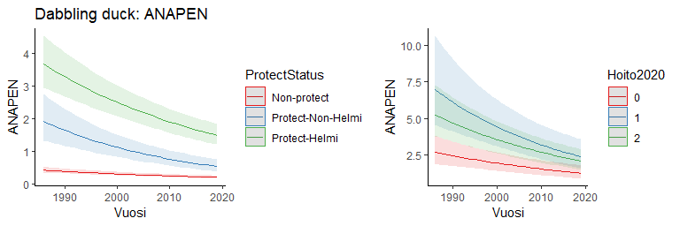
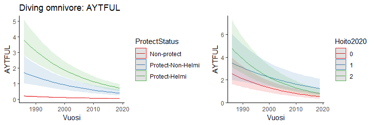
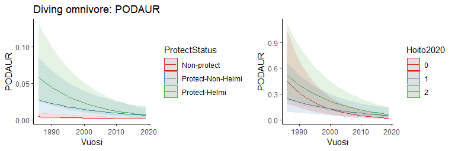

```r
library(glmmTMB)
library(ggplot2)
library(ggeffects)
library (MuMIn)
library(dplyr)
library(cowplot)
```


## The data

```r
mod.data = read.csv('data4model3_20241115.csv')
mod.data$NN = scale(mod.data$NNN)
mod.data$ProtectStatus = factor(mod.data$ProtectStatus, levels=c('Non-protect', 'Protect-Non-Helmi', 'Protect-Helmi'))
mod.data$Hoito2020=mod.data$Hoito
mod.data$Hoito2020[which(mod.data$Hoito2020==1)]=1
mod.data$Hoito2020[which(mod.data$Hoito2020>=2)]=2
mod.data$Hoito20202=0
mod.data$Hoito20202[which(mod.data$Hoito2020>=1)]=1

# species list
species = data.frame(species = colnames(mod.data[,10:45]),
                     tcount = colSums(mod.data[,10:45],na.rm = T), 
                     nobs = colSums(!is.na(mod.data[,10:45])))
guild = read.csv('guilds_20230804.csv')
species = merge(species, guild, by = 'species', all.x = T)

#Select the species with over 100 counted individuals and over 5000 observations
species = species[species$tcount>=500 & species$nobs>=5000,]
# 22 species left
species =
  species %>% mutate(Guild = recode(guild_name, 
                                       "dabbling ducks" = "Dabbling duck",
                                       "diving omnivores" = "Diving omnivore",
                                       "diving piscivores" = "Diving piscivore",
                                       "herons" = "Heron",
                                       .default = "Goose Swan")) 
summary(as.factor(species$Guild))
```

```
##    Dabbling duck  Diving omnivore Diving piscivore       Goose Swan            Heron 
##                7                6                5                3                1
```

```r
# 5 guilds

splist = species$species
splist
```

```
##  [1] "ANAACU" "ANACLY" "ANACRE" "ANAPEN" "ANAPLA" "ANAQUE" "ANASTR" "ANSANS" "AYTFER" "AYTFUL"
## [11] "BOTSTE" "BUCCLA" "CYGCYG" "CYGOLO" "FULATR" "GAVARC" "MELFUS" "MERMER" "MERSER" "PODAUR"
## [21] "PODCRI" "PODGRI"
```


## 1. Test the effect of protect status on waterbird abundance and population trends
## 2. Test the effect of restoration action before 2020 on waterbird abundance and population trends

```r
for (i in 1:length(splist)){
mod.data1 = mod.data[!is.na(mod.data[,splist[i]]),]
## 1. Test the effect of protect status on waterbird abundance and population trends
mod2=glmmTMB(get(splist[i])~
               ProtectStatus*scale(Vuosi)+
               poly(NN,2)+
               (1|SiteID), 
             data=mod.data1,family = nbinom2, REML=FALSE)
print(paste(species$Guild[i], splist[i], sep = ": "))
print(summary(mod2))
print(r.squaredGLMM(mod2))
dat2 = ggpredict(mod2, terms = c("Vuosi[all]","ProtectStatus"))
p1 = plot(dat2) + theme_classic() + 
  ylab(splist[i]) + ggtitle(paste(species$Guild[i], splist[i], sep = ": "))


## 2. Test the effect of restoration action before 2020 on waterbird abundance and population trends
mod.data2 = mod.data1[mod.data1$ProtectStatus=='Protect-Helmi',]
mod.data2$Hoito2020 = as.factor(mod.data2$Hoito2020)
mod3=glmmTMB(get(splist[i])~Hoito2020*scale(Vuosi)+
               poly(NN,2)+
               (1|SiteID), 
             data=mod.data2,family = nbinom2, REML=FALSE)
print(paste(species$Guild[i], splist[i], sep = ": "))
print(summary(mod3))
print(r.squaredGLMM(mod3))
dat3 = ggpredict(mod3, terms = c("Vuosi[all]","Hoito2020"))
p2 = plot(dat3) + theme_classic()+ 
  ylab(splist[i]) + ggtitle("")

print(plot_grid(p1, p2, align = 'h', ncol=2, rel_widths=c(1,0.8)))
}
```

```
## [1] "Dabbling duck: ANAACU"
##  Family: nbinom2  ( log )
## Formula:          get(splist[i]) ~ ProtectStatus * scale(Vuosi) + poly(NN, 2) +      (1 | SiteID)
## Data: mod.data1
## 
##      AIC      BIC   logLik deviance df.resid 
##   5291.5   5358.1  -2635.8   5271.5     5761 
## 
## Random effects:
## 
## Conditional model:
##  Groups Name        Variance Std.Dev.
##  SiteID (Intercept) 3.329    1.825   
## Number of obs: 5771, groups:  SiteID, 994
## 
## Dispersion parameter for nbinom2 family (): 4.84 
## 
## Conditional model:
##                                              Estimate Std. Error z value Pr(>|z|)    
## (Intercept)                                  -5.09709    0.20302 -25.106  < 2e-16 ***
## ProtectStatusProtect-Non-Helmi                1.77222    0.27835   6.367 1.93e-10 ***
## ProtectStatusProtect-Helmi                    3.08672    0.21198  14.561  < 2e-16 ***
## scale(Vuosi)                                 -0.67940    0.08816  -7.707 1.29e-14 ***
## poly(NN, 2)1                                124.47982    6.99003  17.808  < 2e-16 ***
## poly(NN, 2)2                                -60.07871    6.86814  -8.747  < 2e-16 ***
## ProtectStatusProtect-Non-Helmi:scale(Vuosi)   0.09630    0.14201   0.678    0.498    
## ProtectStatusProtect-Helmi:scale(Vuosi)       0.10502    0.10241   1.025    0.305    
## ---
## Signif. codes:  0 '***' 0.001 '**' 0.01 '*' 0.05 '.' 0.1 ' ' 1
##                 R2m       R2c
## delta     0.6100879 0.9768578
## lognormal 0.6113939 0.9789490
## trigamma  0.6085061 0.9743251
## [1] "Dabbling duck: ANAACU"
##  Family: nbinom2  ( log )
## Formula:          get(splist[i]) ~ Hoito2020 * scale(Vuosi) + poly(NN, 2) + (1 |      SiteID)
## Data: mod.data2
## 
##      AIC      BIC   logLik deviance df.resid 
##   2989.5   3041.9  -1484.7   2969.5     1389 
## 
## Random effects:
## 
## Conditional model:
##  Groups Name        Variance Std.Dev.
##  SiteID (Intercept) 2.201    1.484   
## Number of obs: 1399, groups:  SiteID, 283
## 
## Dispersion parameter for nbinom2 family (): 6.74 
## 
## Conditional model:
##                          Estimate Std. Error z value Pr(>|z|)    
## (Intercept)              -2.26450    0.22775  -9.943  < 2e-16 ***
## Hoito20201                1.11652    0.31893   3.501 0.000464 ***
## Hoito20202                0.88840    0.27220   3.264 0.001100 ** 
## scale(Vuosi)             -0.57064    0.10815  -5.276 1.32e-07 ***
## poly(NN, 2)1             63.21637    4.86449  12.995  < 2e-16 ***
## poly(NN, 2)2            -26.31286    4.42283  -5.949 2.69e-09 ***
## Hoito20201:scale(Vuosi)   0.13600    0.14345   0.948 0.343090    
## Hoito20202:scale(Vuosi)   0.02521    0.12337   0.204 0.838073    
## ---
## Signif. codes:  0 '***' 0.001 '**' 0.01 '*' 0.05 '.' 0.1 ' ' 1
##                 R2m       R2c
## delta     0.6101229 0.9379671
## lognormal 0.6163939 0.9476078
## trigamma  0.6013105 0.9244196
```

<!-- -->

```
## [1] "Dabbling duck: ANACLY"
##  Family: nbinom2  ( log )
## Formula:          get(splist[i]) ~ ProtectStatus * scale(Vuosi) + poly(NN, 2) +      (1 | SiteID)
## Data: mod.data1
## 
##      AIC      BIC   logLik deviance df.resid 
##   9551.1   9617.7  -4765.5   9531.1     5761 
## 
## Random effects:
## 
## Conditional model:
##  Groups Name        Variance Std.Dev.
##  SiteID (Intercept) 3.582    1.893   
## Number of obs: 5771, groups:  SiteID, 994
## 
## Dispersion parameter for nbinom2 family ():  4.4 
## 
## Conditional model:
##                                              Estimate Std. Error z value Pr(>|z|)    
## (Intercept)                                  -3.41896    0.14145 -24.171  < 2e-16 ***
## ProtectStatusProtect-Non-Helmi                2.00976    0.23085   8.706  < 2e-16 ***
## ProtectStatusProtect-Helmi                    3.37872    0.17673  19.118  < 2e-16 ***
## scale(Vuosi)                                 -0.08687    0.06282  -1.383  0.16670    
## poly(NN, 2)1                                 12.24629    5.25759   2.329  0.01985 *  
## poly(NN, 2)2                                -18.00608    5.74960  -3.132  0.00174 ** 
## ProtectStatusProtect-Non-Helmi:scale(Vuosi)  -0.25450    0.10784  -2.360  0.01827 *  
## ProtectStatusProtect-Helmi:scale(Vuosi)      -0.16492    0.07213  -2.286  0.02223 *  
## ---
## Signif. codes:  0 '***' 0.001 '**' 0.01 '*' 0.05 '.' 0.1 ' ' 1
##                 R2m       R2c
## delta     0.3508487 0.9089339
## lognormal 0.3577733 0.9268732
## trigamma  0.3401330 0.8811731
## [1] "Dabbling duck: ANACLY"
##  Family: nbinom2  ( log )
## Formula:          get(splist[i]) ~ Hoito2020 * scale(Vuosi) + poly(NN, 2) + (1 |      SiteID)
## Data: mod.data2
## 
##      AIC      BIC   logLik deviance df.resid 
##   5340.6   5393.0  -2660.3   5320.6     1389 
## 
## Random effects:
## 
## Conditional model:
##  Groups Name        Variance Std.Dev.
##  SiteID (Intercept) 1.776    1.333   
## Number of obs: 1399, groups:  SiteID, 283
## 
## Dispersion parameter for nbinom2 family (): 5.33 
## 
## Conditional model:
##                         Estimate Std. Error z value Pr(>|z|)    
## (Intercept)             -0.36089    0.15273  -2.363   0.0181 *  
## Hoito20201               0.79091    0.24230   3.264   0.0011 ** 
## Hoito20202               1.05042    0.21011   4.999 5.75e-07 ***
## scale(Vuosi)            -0.35699    0.06422  -5.559 2.71e-08 ***
## poly(NN, 2)1             4.02417    3.22739   1.247   0.2124    
## poly(NN, 2)2            -8.42467    3.46359  -2.432   0.0150 *  
## Hoito20201:scale(Vuosi)  0.13628    0.09606   1.419   0.1560    
## Hoito20202:scale(Vuosi)  0.18775    0.07631   2.460   0.0139 *  
## ---
## Signif. codes:  0 '***' 0.001 '**' 0.01 '*' 0.05 '.' 0.1 ' ' 1
##                 R2m       R2c
## delta     0.1550370 0.8176993
## lognormal 0.1604724 0.8463667
## trigamma  0.1474433 0.7776482
```

<!-- -->

```
## [1] "Dabbling duck: ANACRE"
##  Family: nbinom2  ( log )
## Formula:          get(splist[i]) ~ ProtectStatus * scale(Vuosi) + poly(NN, 2) +      (1 | SiteID)
## Data: mod.data1
## 
##      AIC      BIC   logLik deviance df.resid 
##  20558.3  20624.9 -10269.1  20538.3     5761 
## 
## Random effects:
## 
## Conditional model:
##  Groups Name        Variance Std.Dev.
##  SiteID (Intercept) 1.219    1.104   
## Number of obs: 5771, groups:  SiteID, 994
## 
## Dispersion parameter for nbinom2 family (): 2.69 
## 
## Conditional model:
##                                             Estimate Std. Error z value Pr(>|z|)    
## (Intercept)                                 -0.38924    0.05628  -6.917 4.63e-12 ***
## ProtectStatusProtect-Non-Helmi               1.25584    0.12073  10.402  < 2e-16 ***
## ProtectStatusProtect-Helmi                   1.87877    0.09108  20.627  < 2e-16 ***
## scale(Vuosi)                                -0.02233    0.03244  -0.688  0.49123    
## poly(NN, 2)1                                22.80088    2.69348   8.465  < 2e-16 ***
## poly(NN, 2)2                                -9.51322    2.90366  -3.276  0.00105 ** 
## ProtectStatusProtect-Non-Helmi:scale(Vuosi) -0.10357    0.06317  -1.640  0.10110    
## ProtectStatusProtect-Helmi:scale(Vuosi)     -0.09400    0.04467  -2.104  0.03535 *  
## ---
## Signif. codes:  0 '***' 0.001 '**' 0.01 '*' 0.05 '.' 0.1 ' ' 1
##                 R2m       R2c
## delta     0.2994586 0.7648417
## lognormal 0.3158601 0.8067324
## trigamma  0.2756533 0.7040411
## [1] "Dabbling duck: ANACRE"
##  Family: nbinom2  ( log )
## Formula:          get(splist[i]) ~ Hoito2020 * scale(Vuosi) + poly(NN, 2) + (1 |      SiteID)
## Data: mod.data2
## 
##      AIC      BIC   logLik deviance df.resid 
##   7780.4   7832.8  -3880.2   7760.4     1389 
## 
## Random effects:
## 
## Conditional model:
##  Groups Name        Variance Std.Dev.
##  SiteID (Intercept) 0.9901   0.9951  
## Number of obs: 1399, groups:  SiteID, 283
## 
## Dispersion parameter for nbinom2 family (): 3.46 
## 
## Conditional model:
##                         Estimate Std. Error z value Pr(>|z|)    
## (Intercept)              1.32504    0.10529  12.584  < 2e-16 ***
## Hoito20201               0.42942    0.17551   2.447  0.01442 *  
## Hoito20202               0.30178    0.15134   1.994  0.04614 *  
## scale(Vuosi)            -0.02522    0.04541  -0.555  0.57862    
## poly(NN, 2)1            10.42002    2.32077   4.490 7.13e-06 ***
## poly(NN, 2)2            -7.33329    2.41680  -3.034  0.00241 ** 
## Hoito20201:scale(Vuosi) -0.10514    0.07903  -1.330  0.18339    
## Hoito20202:scale(Vuosi) -0.13889    0.05886  -2.360  0.01829 *  
## ---
## Signif. codes:  0 '***' 0.001 '**' 0.01 '*' 0.05 '.' 0.1 ' ' 1
##                 R2m       R2c
## delta     0.1171965 0.7417327
## lognormal 0.1223076 0.7740808
## trigamma  0.1105760 0.6998318
```

<!-- -->

```
## [1] "Dabbling duck: ANAPEN"
##  Family: nbinom2  ( log )
## Formula:          get(splist[i]) ~ ProtectStatus * scale(Vuosi) + poly(NN, 2) +      (1 | SiteID)
## Data: mod.data1
## 
##      AIC      BIC   logLik deviance df.resid 
##  16255.6  16322.2  -8117.8  16235.6     5761 
## 
## Random effects:
## 
## Conditional model:
##  Groups Name        Variance Std.Dev.
##  SiteID (Intercept) 1.911    1.382   
## Number of obs: 5771, groups:  SiteID, 994
## 
## Dispersion parameter for nbinom2 family (): 3.23 
## 
## Conditional model:
##                                             Estimate Std. Error z value Pr(>|z|)    
## (Intercept)                                 -1.23827    0.07547 -16.407  < 2e-16 ***
## ProtectStatusProtect-Non-Helmi               1.20467    0.15408   7.819 5.34e-15 ***
## ProtectStatusProtect-Helmi                   2.03385    0.11583  17.559  < 2e-16 ***
## scale(Vuosi)                                -0.22755    0.03824  -5.950 2.68e-09 ***
## poly(NN, 2)1                                35.60098    3.38329  10.523  < 2e-16 ***
## poly(NN, 2)2                                -3.81310    3.67479  -1.038   0.2994    
## ProtectStatusProtect-Non-Helmi:scale(Vuosi) -0.17850    0.07380  -2.419   0.0156 *  
## ProtectStatusProtect-Helmi:scale(Vuosi)     -0.06398    0.05062  -1.264   0.2062    
## ---
## Signif. codes:  0 '***' 0.001 '**' 0.01 '*' 0.05 '.' 0.1 ' ' 1
##                 R2m       R2c
## delta     0.3014799 0.8289247
## lognormal 0.3133726 0.8616241
## trigamma  0.2835362 0.7795884
## [1] "Dabbling duck: ANAPEN"
##  Family: nbinom2  ( log )
## Formula:          get(splist[i]) ~ Hoito2020 * scale(Vuosi) + poly(NN, 2) + (1 |      SiteID)
## Data: mod.data2
## 
##      AIC      BIC   logLik deviance df.resid 
##   6599.9   6652.3  -3289.9   6579.9     1389 
## 
## Random effects:
## 
## Conditional model:
##  Groups Name        Variance Std.Dev.
##  SiteID (Intercept) 1.513    1.23    
## Number of obs: 1399, groups:  SiteID, 283
## 
## Dispersion parameter for nbinom2 family (): 4.25 
## 
## Conditional model:
##                         Estimate Std. Error z value Pr(>|z|)    
## (Intercept)              0.47415    0.13232   3.583 0.000339 ***
## Hoito20201               0.79992    0.21619   3.700 0.000216 ***
## Hoito20202               0.59142    0.18749   3.154 0.001608 ** 
## scale(Vuosi)            -0.22758    0.05191  -4.384 1.17e-05 ***
## poly(NN, 2)1            14.17184    2.86786   4.942 7.75e-07 ***
## poly(NN, 2)2            -6.28346    2.93686  -2.140 0.032394 *  
## Hoito20201:scale(Vuosi) -0.09740    0.08802  -1.107 0.268500    
## Hoito20202:scale(Vuosi) -0.05121    0.06471  -0.791 0.428683    
## ---
## Signif. codes:  0 '***' 0.001 '**' 0.01 '*' 0.05 '.' 0.1 ' ' 1
##                 R2m       R2c
## delta     0.1689547 0.8258202
## lognormal 0.1737736 0.8493740
## trigamma  0.1625378 0.7944552
```

<!-- -->

```
## [1] "Dabbling duck: ANAPLA"
##  Family: nbinom2  ( log )
## Formula:          get(splist[i]) ~ ProtectStatus * scale(Vuosi) + poly(NN, 2) +      (1 | SiteID)
## Data: mod.data1
## 
##      AIC      BIC   logLik deviance df.resid 
##  22957.7  23024.3 -11468.8  22937.7     5761 
## 
## Random effects:
## 
## Conditional model:
##  Groups Name        Variance Std.Dev.
##  SiteID (Intercept) 1.193    1.092   
## Number of obs: 5771, groups:  SiteID, 994
## 
## Dispersion parameter for nbinom2 family (): 5.47 
## 
## Conditional model:
##                                             Estimate Std. Error z value Pr(>|z|)    
## (Intercept)                                  0.12414    0.05195   2.389 0.016875 *  
## ProtectStatusProtect-Non-Helmi               0.89884    0.11473   7.834 4.71e-15 ***
## ProtectStatusProtect-Helmi                   1.60578    0.08649  18.566  < 2e-16 ***
## scale(Vuosi)                                 0.06630    0.02577   2.572 0.010098 *  
## poly(NN, 2)1                                -9.82566    2.59086  -3.792 0.000149 ***
## poly(NN, 2)2                                 8.08341    2.78992   2.897 0.003763 ** 
## ProtectStatusProtect-Non-Helmi:scale(Vuosi) -0.12499    0.05137  -2.433 0.014975 *  
## ProtectStatusProtect-Helmi:scale(Vuosi)     -0.05965    0.03523  -1.693 0.090402 .  
## ---
## Signif. codes:  0 '***' 0.001 '**' 0.01 '*' 0.05 '.' 0.1 ' ' 1
##                 R2m       R2c
## delta     0.2436235 0.8133780
## lognormal 0.2509212 0.8377427
## trigamma  0.2340129 0.7812916
## [1] "Dabbling duck: ANAPLA"
##  Family: nbinom2  ( log )
## Formula:          get(splist[i]) ~ Hoito2020 * scale(Vuosi) + poly(NN, 2) + (1 |      SiteID)
## Data: mod.data2
## 
##      AIC      BIC   logLik deviance df.resid 
##   8051.3   8103.7  -4015.6   8031.3     1389 
## 
## Random effects:
## 
## Conditional model:
##  Groups Name        Variance Std.Dev.
##  SiteID (Intercept) 1.307    1.143   
## Number of obs: 1399, groups:  SiteID, 283
## 
## Dispersion parameter for nbinom2 family (): 6.65 
## 
## Conditional model:
##                         Estimate Std. Error z value Pr(>|z|)    
## (Intercept)              1.46127    0.11554  12.648  < 2e-16 ***
## Hoito20201               0.41442    0.19285   2.149  0.03164 *  
## Hoito20202               0.44341    0.16734   2.650  0.00805 ** 
## scale(Vuosi)             0.03214    0.03660   0.878  0.37993    
## poly(NN, 2)1            -7.34012    2.56675  -2.860  0.00424 ** 
## poly(NN, 2)2             0.70964    2.66409   0.266  0.78995    
## Hoito20201:scale(Vuosi)  0.01227    0.06343   0.193  0.84665    
## Hoito20202:scale(Vuosi) -0.07049    0.04734  -1.489  0.13644    
## ---
## Signif. codes:  0 '***' 0.001 '**' 0.01 '*' 0.05 '.' 0.1 ' ' 1
##                  R2m       R2c
## delta     0.04376693 0.8500287
## lognormal 0.04446617 0.8636090
## trigamma  0.04292190 0.8336166
```

<!-- -->

```
## [1] "Dabbling duck: ANAQUE"
##  Family: nbinom2  ( log )
## Formula:          get(splist[i]) ~ ProtectStatus * scale(Vuosi) + poly(NN, 2) +      (1 | SiteID)
## Data: mod.data1
## 
##      AIC      BIC   logLik deviance df.resid 
##   5534.4   5601.0  -2757.2   5514.4     5761 
## 
## Random effects:
## 
## Conditional model:
##  Groups Name        Variance Std.Dev.
##  SiteID (Intercept) 3.35     1.83    
## Number of obs: 5771, groups:  SiteID, 994
## 
## Dispersion parameter for nbinom2 family (): 4.24 
## 
## Conditional model:
##                                              Estimate Std. Error z value Pr(>|z|)    
## (Intercept)                                  -4.55101    0.18941 -24.027  < 2e-16 ***
## ProtectStatusProtect-Non-Helmi                1.53042    0.27962   5.473 4.42e-08 ***
## ProtectStatusProtect-Helmi                    3.35905    0.20470  16.409  < 2e-16 ***
## scale(Vuosi)                                 -0.42861    0.09521  -4.502 6.75e-06 ***
## poly(NN, 2)1                                  1.65284    6.21759   0.266   0.7904    
## poly(NN, 2)2                                -13.98354    6.73438  -2.076   0.0379 *  
## ProtectStatusProtect-Non-Helmi:scale(Vuosi)  -0.36953    0.18116  -2.040   0.0414 *  
## ProtectStatusProtect-Helmi:scale(Vuosi)      -0.04218    0.10720  -0.394   0.6939    
## ---
## Signif. codes:  0 '***' 0.001 '**' 0.01 '*' 0.05 '.' 0.1 ' ' 1
##                 R2m       R2c
## delta     0.3546094 0.8558607
## lognormal 0.3706179 0.8944979
## trigamma  0.3256403 0.7859429
## [1] "Dabbling duck: ANAQUE"
##  Family: nbinom2  ( log )
## Formula:          get(splist[i]) ~ Hoito2020 * scale(Vuosi) + poly(NN, 2) + (1 |      SiteID)
## Data: mod.data2
## 
##      AIC      BIC   logLik deviance df.resid 
##   3500.7   3553.1  -1740.3   3480.7     1389 
## 
## Random effects:
## 
## Conditional model:
##  Groups Name        Variance Std.Dev.
##  SiteID (Intercept) 1.498    1.224   
## Number of obs: 1399, groups:  SiteID, 283
## 
## Dispersion parameter for nbinom2 family ():  4.1 
## 
## Conditional model:
##                          Estimate Std. Error z value Pr(>|z|)    
## (Intercept)             -1.503060   0.173369  -8.670  < 2e-16 ***
## Hoito20201               0.683727   0.260154   2.628  0.00858 ** 
## Hoito20202               1.333189   0.220339   6.051 1.44e-09 ***
## scale(Vuosi)            -0.447128   0.102871  -4.346 1.38e-05 ***
## poly(NN, 2)1             1.686245   3.383973   0.498  0.61827    
## poly(NN, 2)2            -8.888718   3.709931  -2.396  0.01658 *  
## Hoito20201:scale(Vuosi)  0.008932   0.147526   0.061  0.95172    
## Hoito20202:scale(Vuosi)  0.009623   0.117410   0.082  0.93468    
## ---
## Signif. codes:  0 '***' 0.001 '**' 0.01 '*' 0.05 '.' 0.1 ' ' 1
##                 R2m       R2c
## delta     0.2044663 0.6526344
## lognormal 0.2315171 0.7389777
## trigamma  0.1613368 0.5149698
```

<!-- -->

```
## [1] "Dabbling duck: ANASTR"
##  Family: nbinom2  ( log )
## Formula:          get(splist[i]) ~ ProtectStatus * scale(Vuosi) + poly(NN, 2) +      (1 | SiteID)
## Data: mod.data1
## 
##      AIC      BIC   logLik deviance df.resid 
##       NA       NA       NA       NA     5761 
## 
## Random effects:
## 
## Conditional model:
##  Groups Name        Variance Std.Dev.
##  SiteID (Intercept) 22.4     4.733   
## Number of obs: 5771, groups:  SiteID, 994
## 
## Dispersion parameter for nbinom2 family (): 3.81e+14 
## 
## Conditional model:
##                                             Estimate Std. Error z value Pr(>|z|)    
## (Intercept)                                  -8.8945     0.2919 -30.474  < 2e-16 ***
## ProtectStatusProtect-Non-Helmi                1.0630     0.7655   1.389  0.16497    
## ProtectStatusProtect-Helmi                    2.3649     0.3739   6.326 2.52e-10 ***
## scale(Vuosi)                                  0.7639     0.1710   4.467 7.94e-06 ***
## poly(NN, 2)1                                  7.6546    12.5733   0.609  0.54266    
## poly(NN, 2)2                                 15.9728    13.7253   1.164  0.24453    
## ProtectStatusProtect-Non-Helmi:scale(Vuosi)   0.2750     0.3656   0.752  0.45191    
## ProtectStatusProtect-Helmi:scale(Vuosi)       0.5128     0.1932   2.655  0.00794 ** 
## ---
## Signif. codes:  0 '***' 0.001 '**' 0.01 '*' 0.05 '.' 0.1 ' ' 1
##                  R2m       R2c
## delta     0.07317991 0.9999998
## lognormal 0.07317991 0.9999998
## trigamma  0.07317991 0.9999998
## [1] "Dabbling duck: ANASTR"
##  Family: nbinom2  ( log )
## Formula:          get(splist[i]) ~ Hoito2020 * scale(Vuosi) + poly(NN, 2) + (1 |      SiteID)
## Data: mod.data2
## 
##      AIC      BIC   logLik deviance df.resid 
##       NA       NA       NA       NA     1389 
## 
## Random effects:
## 
## Conditional model:
##  Groups Name        Variance Std.Dev.
##  SiteID (Intercept) 8.285    2.878   
## Number of obs: 1399, groups:  SiteID, 283
## 
## Dispersion parameter for nbinom2 family (): 3.47e+07 
## 
## Conditional model:
##                         Estimate Std. Error z value Pr(>|z|)    
## (Intercept)              -5.3746     0.6178  -8.700  < 2e-16 ***
## Hoito20201                0.5109     0.7108   0.719 0.472274    
## Hoito20202                0.6997     0.5938   1.178 0.238652    
## scale(Vuosi)              0.9323     0.2781   3.352 0.000802 ***
## poly(NN, 2)1             -0.0570     8.3051  -0.007 0.994524    
## poly(NN, 2)2             14.6769     8.7467   1.678 0.093350 .  
## Hoito20201:scale(Vuosi)  -0.2386     0.4419  -0.540 0.589204    
## Hoito20202:scale(Vuosi)   0.3329     0.3036   1.096 0.272876    
## ---
## Signif. codes:  0 '***' 0.001 '**' 0.01 '*' 0.05 '.' 0.1 ' ' 1
##                 R2m       R2c
## delta     0.1382447 0.9499641
## lognormal 0.1395866 0.9591854
## trigamma  0.1362213 0.9360602
```

<!-- -->

```
## [1] "Goose Swan: ANSANS"
##  Family: nbinom2  ( log )
## Formula:          get(splist[i]) ~ ProtectStatus * scale(Vuosi) + poly(NN, 2) +      (1 | SiteID)
## Data: mod.data1
## 
##      AIC      BIC   logLik deviance df.resid 
##   1476.8   1543.4   -728.4   1456.8     5761 
## 
## Random effects:
## 
## Conditional model:
##  Groups Name        Variance Std.Dev.
##  SiteID (Intercept) 65.54    8.096   
## Number of obs: 5771, groups:  SiteID, 994
## 
## Dispersion parameter for nbinom2 family ():  1.5 
## 
## Conditional model:
##                                             Estimate Std. Error z value Pr(>|z|)    
## (Intercept)                                 -11.5674     0.9683 -11.947   <2e-16 ***
## ProtectStatusProtect-Non-Helmi               -0.1607     1.6328  -0.098   0.9216    
## ProtectStatusProtect-Helmi                    2.6890     0.9685   2.776   0.0055 ** 
## scale(Vuosi)                                  0.9083     0.7074   1.284   0.1991    
## poly(NN, 2)1                                 53.8322    22.8778   2.353   0.0186 *  
## poly(NN, 2)2                                 -5.4269    24.9868  -0.217   0.8281    
## ProtectStatusProtect-Non-Helmi:scale(Vuosi)   1.0635     1.1092   0.959   0.3377    
## ProtectStatusProtect-Helmi:scale(Vuosi)       0.3968     0.7332   0.541   0.5884    
## ---
## Signif. codes:  0 '***' 0.001 '**' 0.01 '*' 0.05 '.' 0.1 ' ' 1
##                  R2m       R2c
## delta     0.04280266 0.9903682
## lognormal 0.04289920 0.9926019
## trigamma  0.04263763 0.9865497
## [1] "Goose Swan: ANSANS"
##  Family: nbinom2  ( log )
## Formula:          get(splist[i]) ~ Hoito2020 * scale(Vuosi) + poly(NN, 2) + (1 |      SiteID)
## Data: mod.data2
## 
##      AIC      BIC   logLik deviance df.resid 
##   1108.4   1160.8   -544.2   1088.4     1389 
## 
## Random effects:
## 
## Conditional model:
##  Groups Name        Variance Std.Dev.
##  SiteID (Intercept) 32.21    5.675   
## Number of obs: 1399, groups:  SiteID, 283
## 
## Dispersion parameter for nbinom2 family (): 1.99 
## 
## Conditional model:
##                         Estimate Std. Error z value Pr(>|z|)    
## (Intercept)              -8.5248     1.0651  -8.004 1.21e-15 ***
## Hoito20201               -1.1139     1.4499  -0.768  0.44235    
## Hoito20202                1.7588     0.9797   1.795  0.07262 .  
## scale(Vuosi)              0.9532     0.2976   3.203  0.00136 ** 
## poly(NN, 2)1             40.4453    14.2615   2.836  0.00457 ** 
## poly(NN, 2)2             17.1170    16.0228   1.068  0.28539    
## Hoito20201:scale(Vuosi)   1.3196     0.7269   1.816  0.06945 .  
## Hoito20202:scale(Vuosi)   0.1653     0.3663   0.451  0.65173    
## ---
## Signif. codes:  0 '***' 0.001 '**' 0.01 '*' 0.05 '.' 0.1 ' ' 1
##                 R2m       R2c
## delta     0.1343441 0.9867262
## lognormal 0.1346829 0.9892149
## trigamma  0.1338273 0.9829306
```

<!-- -->

```
## [1] "Diving omnivore: AYTFER"
##  Family: nbinom2  ( log )
## Formula:          get(splist[i]) ~ ProtectStatus * scale(Vuosi) + poly(NN, 2) +      (1 | SiteID)
## Data: mod.data1
## 
##      AIC      BIC   logLik deviance df.resid 
##   8221.7   8288.3  -4100.8   8201.7     5761 
## 
## Random effects:
## 
## Conditional model:
##  Groups Name        Variance Std.Dev.
##  SiteID (Intercept) 4.67     2.161   
## Number of obs: 5771, groups:  SiteID, 994
## 
## Dispersion parameter for nbinom2 family (): 2.83 
## 
## Conditional model:
##                                               Estimate Std. Error z value Pr(>|z|)    
## (Intercept)                                   -4.30871    0.19611 -21.971  < 2e-16 ***
## ProtectStatusProtect-Non-Helmi                 2.04882    0.29754   6.886 5.74e-12 ***
## ProtectStatusProtect-Helmi                     2.97652    0.21815  13.645  < 2e-16 ***
## scale(Vuosi)                                  -0.55390    0.07244  -7.647 2.06e-14 ***
## poly(NN, 2)1                                -111.46580   14.06760  -7.924 2.31e-15 ***
## poly(NN, 2)2                                 -79.67698   12.44031  -6.405 1.51e-10 ***
## ProtectStatusProtect-Non-Helmi:scale(Vuosi)   -0.53685    0.14706  -3.651 0.000262 ***
## ProtectStatusProtect-Helmi:scale(Vuosi)       -0.20277    0.08910  -2.276 0.022865 *  
## ---
## Signif. codes:  0 '***' 0.001 '**' 0.01 '*' 0.05 '.' 0.1 ' ' 1
##                 R2m       R2c
## delta     0.5054301 0.9497340
## lognormal 0.5104884 0.9592389
## trigamma  0.4977133 0.9352337
## [1] "Diving omnivore: AYTFER"
##  Family: nbinom2  ( log )
## Formula:          get(splist[i]) ~ Hoito2020 * scale(Vuosi) + poly(NN, 2) + (1 |      SiteID)
## Data: mod.data2
## 
##      AIC      BIC   logLik deviance df.resid 
##   4215.6   4268.0  -2097.8   4195.6     1389 
## 
## Random effects:
## 
## Conditional model:
##  Groups Name        Variance Std.Dev.
##  SiteID (Intercept) 2.795    1.672   
## Number of obs: 1399, groups:  SiteID, 283
## 
## Dispersion parameter for nbinom2 family (): 3.08 
## 
## Conditional model:
##                          Estimate Std. Error z value Pr(>|z|)    
## (Intercept)              -1.23887    0.21909  -5.655 1.56e-08 ***
## Hoito20201                0.56807    0.32350   1.756   0.0791 .  
## Hoito20202                0.62318    0.29299   2.127   0.0334 *  
## scale(Vuosi)             -0.83007    0.08411  -9.869  < 2e-16 ***
## poly(NN, 2)1            -36.49248    5.58910  -6.529 6.61e-11 ***
## poly(NN, 2)2            -30.70771    6.00845  -5.111 3.21e-07 ***
## Hoito20201:scale(Vuosi)   0.33902    0.14087   2.407   0.0161 *  
## Hoito20202:scale(Vuosi)   0.17415    0.10621   1.640   0.1011    
## ---
## Signif. codes:  0 '***' 0.001 '**' 0.01 '*' 0.05 '.' 0.1 ' ' 1
##                 R2m       R2c
## delta     0.4091433 0.8798845
## lognormal 0.4215571 0.9065810
## trigamma  0.3888369 0.8362144
```

<!-- -->

```
## [1] "Diving omnivore: AYTFUL"
##  Family: nbinom2  ( log )
## Formula:          get(splist[i]) ~ ProtectStatus * scale(Vuosi) + poly(NN, 2) +      (1 | SiteID)
## Data: mod.data1
## 
##      AIC      BIC   logLik deviance df.resid 
##  14256.0  14322.6  -7118.0  14236.0     5761 
## 
## Random effects:
## 
## Conditional model:
##  Groups Name        Variance Std.Dev.
##  SiteID (Intercept) 3.736    1.933   
## Number of obs: 5771, groups:  SiteID, 994
## 
## Dispersion parameter for nbinom2 family (): 1.78 
## 
## Conditional model:
##                                             Estimate Std. Error z value Pr(>|z|)    
## (Intercept)                                 -2.28149    0.11821 -19.301  < 2e-16 ***
## ProtectStatusProtect-Non-Helmi               2.00782    0.21646   9.276  < 2e-16 ***
## ProtectStatusProtect-Helmi                   2.68775    0.16751  16.045  < 2e-16 ***
## scale(Vuosi)                                -0.42338    0.05368  -7.887  3.1e-15 ***
## poly(NN, 2)1                                57.09429    4.78281  11.937  < 2e-16 ***
## poly(NN, 2)2                                -7.17361    5.19708  -1.380    0.167    
## ProtectStatusProtect-Non-Helmi:scale(Vuosi) -0.04198    0.09481  -0.443    0.658    
## ProtectStatusProtect-Helmi:scale(Vuosi)     -0.11231    0.07078  -1.587    0.113    
## ---
## Signif. codes:  0 '***' 0.001 '**' 0.01 '*' 0.05 '.' 0.1 ' ' 1
##                 R2m       R2c
## delta     0.3390759 0.8949674
## lognormal 0.3479709 0.9184453
## trigamma  0.3244376 0.8563307
## [1] "Diving omnivore: AYTFUL"
##  Family: nbinom2  ( log )
## Formula:          get(splist[i]) ~ Hoito2020 * scale(Vuosi) + poly(NN, 2) + (1 |      SiteID)
## Data: mod.data2
## 
##      AIC      BIC   logLik deviance df.resid 
##   6173.1   6225.6  -3076.6   6153.1     1389 
## 
## Random effects:
## 
## Conditional model:
##  Groups Name        Variance Std.Dev.
##  SiteID (Intercept) 2.288    1.513   
## Number of obs: 1399, groups:  SiteID, 283
## 
## Dispersion parameter for nbinom2 family (): 1.86 
## 
## Conditional model:
##                         Estimate Std. Error z value Pr(>|z|)    
## (Intercept)              0.24642    0.16486   1.495   0.1350    
## Hoito20201               0.56908    0.27180   2.094   0.0363 *  
## Hoito20202               0.52517    0.23318   2.252   0.0243 *  
## scale(Vuosi)            -0.47701    0.07202  -6.623 3.52e-11 ***
## poly(NN, 2)1            24.21567    3.56050   6.801 1.04e-11 ***
## poly(NN, 2)2             2.64756    3.64458   0.726   0.4676    
## Hoito20201:scale(Vuosi)  0.16183    0.12245   1.322   0.1863    
## Hoito20202:scale(Vuosi) -0.06722    0.09320  -0.721   0.4708    
## ---
## Signif. codes:  0 '***' 0.001 '**' 0.01 '*' 0.05 '.' 0.1 ' ' 1
##                 R2m       R2c
## delta     0.1876065 0.8160188
## lognormal 0.1960685 0.8528251
## trigamma  0.1746124 0.7594991
```

<!-- -->

```
## [1] "Heron: BOTSTE"
##  Family: nbinom2  ( log )
## Formula:          get(splist[i]) ~ ProtectStatus * scale(Vuosi) + poly(NN, 2) +      (1 | SiteID)
## Data: mod.data1
## 
##      AIC      BIC   logLik deviance df.resid 
##   2944.8   3011.4  -1462.4   2924.8     5761 
## 
## Random effects:
## 
## Conditional model:
##  Groups Name        Variance Std.Dev.
##  SiteID (Intercept) 3.969    1.992   
## Number of obs: 5771, groups:  SiteID, 994
## 
## Dispersion parameter for nbinom2 family (): 19.1 
## 
## Conditional model:
##                                             Estimate Std. Error z value Pr(>|z|)    
## (Intercept)                                  -5.9861     0.2968 -20.171  < 2e-16 ***
## ProtectStatusProtect-Non-Helmi                1.6197     0.4186   3.870 0.000109 ***
## ProtectStatusProtect-Helmi                    3.6283     0.3021  12.011  < 2e-16 ***
## scale(Vuosi)                                  1.4564     0.2052   7.096 1.28e-12 ***
## poly(NN, 2)1                                -55.9968    12.5439  -4.464 8.04e-06 ***
## poly(NN, 2)2                                -16.4124    11.7390  -1.398 0.162080    
## ProtectStatusProtect-Non-Helmi:scale(Vuosi)  -0.2120     0.2987  -0.710 0.477742    
## ProtectStatusProtect-Helmi:scale(Vuosi)      -0.8508     0.2175  -3.911 9.19e-05 ***
## ---
## Signif. codes:  0 '***' 0.001 '**' 0.01 '*' 0.05 '.' 0.1 ' ' 1
##                 R2m       R2c
## delta     0.5340010 0.9907255
## lognormal 0.5341905 0.9910771
## trigamma  0.5337962 0.9903454
## [1] "Heron: BOTSTE"
##  Family: nbinom2  ( log )
## Formula:          get(splist[i]) ~ Hoito2020 * scale(Vuosi) + poly(NN, 2) + (1 |      SiteID)
## Data: mod.data2
## 
##      AIC      BIC   logLik deviance df.resid 
##   1747.9   1800.3   -863.9   1727.9     1389 
## 
## Random effects:
## 
## Conditional model:
##  Groups Name        Variance Std.Dev.
##  SiteID (Intercept) 2.833    1.683   
## Number of obs: 1399, groups:  SiteID, 283
## 
## Dispersion parameter for nbinom2 family (): 8.69 
## 
## Conditional model:
##                          Estimate Std. Error z value Pr(>|z|)    
## (Intercept)              -2.27088    0.24364  -9.321  < 2e-16 ***
## Hoito20201                0.05590    0.36707   0.152  0.87896    
## Hoito20202                0.14179    0.31780   0.446  0.65549    
## scale(Vuosi)              0.57086    0.11102   5.142 2.72e-07 ***
## poly(NN, 2)1            -16.21587    5.27673  -3.073  0.00212 ** 
## poly(NN, 2)2            -10.88593    5.80058  -1.877  0.06056 .  
## Hoito20201:scale(Vuosi)   0.15791    0.19971   0.791  0.42911    
## Hoito20202:scale(Vuosi)   0.02978    0.14945   0.199  0.84206    
## ---
## Signif. codes:  0 '***' 0.001 '**' 0.01 '*' 0.05 '.' 0.1 ' ' 1
##                  R2m       R2c
## delta     0.11396681 0.6798712
## lognormal 0.13085400 0.7806121
## trigamma  0.08373525 0.4995243
```

<!-- -->

```
## [1] "Diving omnivore: BUCCLA"
##  Family: nbinom2  ( log )
## Formula:          get(splist[i]) ~ ProtectStatus * scale(Vuosi) + poly(NN, 2) +      (1 | SiteID)
## Data: mod.data1
## 
##      AIC      BIC   logLik deviance df.resid 
##  24043.4  24110.0 -12011.7  24023.4     5761 
## 
## Random effects:
## 
## Conditional model:
##  Groups Name        Variance Std.Dev.
##  SiteID (Intercept) 1.294    1.138   
## Number of obs: 5771, groups:  SiteID, 994
## 
## Dispersion parameter for nbinom2 family (): 5.46 
## 
## Conditional model:
##                                             Estimate Std. Error z value Pr(>|z|)    
## (Intercept)                                  0.32714    0.05326   6.142 8.15e-10 ***
## ProtectStatusProtect-Non-Helmi               0.85756    0.11680   7.342 2.11e-13 ***
## ProtectStatusProtect-Helmi                   1.05026    0.08960  11.722  < 2e-16 ***
## scale(Vuosi)                                 0.08437    0.02492   3.385 0.000712 ***
## poly(NN, 2)1                                 9.96016    2.62451   3.795 0.000148 ***
## poly(NN, 2)2                                 5.97168    2.82671   2.113 0.034636 *  
## ProtectStatusProtect-Non-Helmi:scale(Vuosi) -0.02482    0.04879  -0.509 0.610919    
## ProtectStatusProtect-Helmi:scale(Vuosi)      0.05313    0.03612   1.471 0.141260    
## ---
## Signif. codes:  0 '***' 0.001 '**' 0.01 '*' 0.05 '.' 0.1 ' ' 1
##                 R2m       R2c
## delta     0.1317268 0.7982678
## lognormal 0.1360113 0.8242319
## trigamma  0.1261129 0.7642472
## [1] "Diving omnivore: BUCCLA"
##  Family: nbinom2  ( log )
## Formula:          get(splist[i]) ~ Hoito2020 * scale(Vuosi) + poly(NN, 2) + (1 |      SiteID)
## Data: mod.data2
## 
##      AIC      BIC   logLik deviance df.resid 
##   7596.3   7648.7  -3788.1   7576.3     1389 
## 
## Random effects:
## 
## Conditional model:
##  Groups Name        Variance Std.Dev.
##  SiteID (Intercept) 1.388    1.178   
## Number of obs: 1399, groups:  SiteID, 283
## 
## Dispersion parameter for nbinom2 family (): 4.01 
## 
## Conditional model:
##                          Estimate Std. Error z value Pr(>|z|)    
## (Intercept)              1.288840   0.122358  10.533  < 2e-16 ***
## Hoito20201               0.333473   0.203239   1.641 0.100841    
## Hoito20202               0.096246   0.175943   0.547 0.584359    
## scale(Vuosi)             0.043144   0.041585   1.037 0.299512    
## poly(NN, 2)1            -1.949109   2.694131  -0.723 0.469394    
## poly(NN, 2)2            -3.522160   2.768161  -1.272 0.203237    
## Hoito20201:scale(Vuosi)  0.007677   0.079859   0.096 0.923415    
## Hoito20202:scale(Vuosi)  0.199061   0.058481   3.404 0.000664 ***
## ---
## Signif. codes:  0 '***' 0.001 '**' 0.01 '*' 0.05 '.' 0.1 ' ' 1
##                  R2m       R2c
## delta     0.02645056 0.7949269
## lognormal 0.02728589 0.8200315
## trigamma  0.02537106 0.7624844
```

<!-- -->

```
## [1] "Goose Swan: CYGCYG"
##  Family: nbinom2  ( log )
## Formula:          get(splist[i]) ~ ProtectStatus * scale(Vuosi) + poly(NN, 2) +      (1 | SiteID)
## Data: mod.data1
## 
##      AIC      BIC   logLik deviance df.resid 
##   7095.4   7162.0  -3537.7   7075.4     5761 
## 
## Random effects:
## 
## Conditional model:
##  Groups Name        Variance Std.Dev.
##  SiteID (Intercept) 1.084    1.041   
## Number of obs: 5771, groups:  SiteID, 994
## 
## Dispersion parameter for nbinom2 family (): 3.06e+07 
## 
## Conditional model:
##                                              Estimate Std. Error z value Pr(>|z|)    
## (Intercept)                                  -2.35077    0.08124 -28.936  < 2e-16 ***
## ProtectStatusProtect-Non-Helmi                0.90167    0.15022   6.002 1.94e-09 ***
## ProtectStatusProtect-Helmi                    1.34217    0.11091  12.101  < 2e-16 ***
## scale(Vuosi)                                  0.79207    0.05831  13.584  < 2e-16 ***
## poly(NN, 2)1                                 21.54467    3.25585   6.617 3.66e-11 ***
## poly(NN, 2)2                                -13.26868    3.51828  -3.771 0.000162 ***
## ProtectStatusProtect-Non-Helmi:scale(Vuosi)  -0.13044    0.10635  -1.226 0.220023    
## ProtectStatusProtect-Helmi:scale(Vuosi)       0.10019    0.07579   1.322 0.186168    
## ---
## Signif. codes:  0 '***' 0.001 '**' 0.01 '*' 0.05 '.' 0.1 ' ' 1
##                 R2m       R2c
## delta     0.2403477 0.4949209
## lognormal 0.3144056 0.6474200
## trigamma  0.1329648 0.2737995
## [1] "Goose Swan: CYGCYG"
##  Family: nbinom2  ( log )
## Formula:          get(splist[i]) ~ Hoito2020 * scale(Vuosi) + poly(NN, 2) + (1 |      SiteID)
## Data: mod.data2
## 
##      AIC      BIC   logLik deviance df.resid 
##   2617.8   2670.2  -1298.9   2597.8     1389 
## 
## Random effects:
## 
## Conditional model:
##  Groups Name        Variance Std.Dev.
##  SiteID (Intercept) 0.7849   0.8859  
## Number of obs: 1399, groups:  SiteID, 283
## 
## Dispersion parameter for nbinom2 family (): 1.68e+07 
## 
## Conditional model:
##                          Estimate Std. Error z value Pr(>|z|)    
## (Intercept)              -0.90196    0.12575  -7.173 7.35e-13 ***
## Hoito20201               -0.04085    0.20588  -0.198   0.8427    
## Hoito20202               -0.35242    0.17184  -2.051   0.0403 *  
## scale(Vuosi)              0.77505    0.07427  10.435  < 2e-16 ***
## poly(NN, 2)1             15.80005    2.60725   6.060 1.36e-09 ***
## poly(NN, 2)2            -13.30788    2.68990  -4.947 7.52e-07 ***
## Hoito20201:scale(Vuosi)   0.08080    0.13439   0.601   0.5477    
## Hoito20202:scale(Vuosi)   0.06621    0.09834   0.673   0.5007    
## ---
## Signif. codes:  0 '***' 0.001 '**' 0.01 '*' 0.05 '.' 0.1 ' ' 1
##                 R2m       R2c
## delta     0.3423310 0.6171685
## lognormal 0.3908557 0.7046509
## trigamma  0.2686471 0.4843281
```

<!-- -->

```
## [1] "Goose Swan: CYGOLO"
##  Family: nbinom2  ( log )
## Formula:          get(splist[i]) ~ ProtectStatus * scale(Vuosi) + poly(NN, 2) +      (1 | SiteID)
## Data: mod.data1
## 
##      AIC      BIC   logLik deviance df.resid 
##   2510.0   2576.6  -1245.0   2490.0     5761 
## 
## Random effects:
## 
## Conditional model:
##  Groups Name        Variance Std.Dev.
##  SiteID (Intercept) 26.04    5.103   
## Number of obs: 5771, groups:  SiteID, 994
## 
## Dispersion parameter for nbinom2 family (): 95.4 
## 
## Conditional model:
##                                             Estimate Std. Error z value Pr(>|z|)    
## (Intercept)                                  -9.2529     0.6086 -15.203  < 2e-16 ***
## ProtectStatusProtect-Non-Helmi                1.1646     0.7482   1.556 0.119591    
## ProtectStatusProtect-Helmi                    2.8010     0.5442   5.147 2.65e-07 ***
## scale(Vuosi)                                  0.8851     0.2134   4.148 3.36e-05 ***
## poly(NN, 2)1                                -92.0195    25.6679  -3.585 0.000337 ***
## poly(NN, 2)2                                 67.9539    20.5751   3.303 0.000958 ***
## ProtectStatusProtect-Non-Helmi:scale(Vuosi)  -0.3979     0.2735  -1.455 0.145779    
## ProtectStatusProtect-Helmi:scale(Vuosi)      -0.3076     0.2183  -1.409 0.158834    
## ---
## Signif. codes:  0 '***' 0.001 '**' 0.01 '*' 0.05 '.' 0.1 ' ' 1
##                 R2m       R2c
## delta     0.1405058 0.9996541
## lognormal 0.1405061 0.9996559
## trigamma  0.1405056 0.9996523
## [1] "Goose Swan: CYGOLO"
##  Family: nbinom2  ( log )
## Formula:          get(splist[i]) ~ Hoito2020 * scale(Vuosi) + poly(NN, 2) + (1 |      SiteID)
## Data: mod.data2
## 
##      AIC      BIC   logLik deviance df.resid 
##   1464.1   1516.5   -722.0   1444.1     1389 
## 
## Random effects:
## 
## Conditional model:
##  Groups Name        Variance Std.Dev.
##  SiteID (Intercept) 13.31    3.648   
## Number of obs: 1399, groups:  SiteID, 283
## 
## Dispersion parameter for nbinom2 family (): 6.93e+05 
## 
## Conditional model:
##                          Estimate Std. Error z value Pr(>|z|)    
## (Intercept)              -5.97029    0.75801  -7.876 3.37e-15 ***
## Hoito20201                0.81743    0.84852   0.963   0.3354    
## Hoito20202                0.65694    0.76229   0.862   0.3888    
## scale(Vuosi)              0.54269    0.05346  10.151  < 2e-16 ***
## poly(NN, 2)1            -73.16156   12.66739  -5.776 7.67e-09 ***
## poly(NN, 2)2             52.27579   12.15683   4.300 1.71e-05 ***
## Hoito20201:scale(Vuosi)  -0.37862    0.22351  -1.694   0.0903 .  
## Hoito20202:scale(Vuosi)   0.02378    0.08946   0.266   0.7903    
## ---
## Signif. codes:  0 '***' 0.001 '**' 0.01 '*' 0.05 '.' 0.1 ' ' 1
##                 R2m       R2c
## delta     0.2986699 0.9999999
## lognormal 0.2986699 0.9999999
## trigamma  0.2986699 0.9999999
```

<!-- -->

```
## [1] "Diving omnivore: FULATR"
##  Family: nbinom2  ( log )
## Formula:          get(splist[i]) ~ ProtectStatus * scale(Vuosi) + poly(NN, 2) +      (1 | SiteID)
## Data: mod.data1
## 
##      AIC      BIC   logLik deviance df.resid 
##  13025.5  13092.1  -6502.7  13005.5     5761 
## 
## Random effects:
## 
## Conditional model:
##  Groups Name        Variance Std.Dev.
##  SiteID (Intercept) 7.299    2.702   
## Number of obs: 5771, groups:  SiteID, 994
## 
## Dispersion parameter for nbinom2 family (): 2.12 
## 
## Conditional model:
##                                               Estimate Std. Error z value Pr(>|z|)    
## (Intercept)                                   -4.09462    0.21712 -18.859  < 2e-16 ***
## ProtectStatusProtect-Non-Helmi                 2.76168    0.33024   8.363  < 2e-16 ***
## ProtectStatusProtect-Helmi                     3.83445    0.25104  15.274  < 2e-16 ***
## scale(Vuosi)                                  -0.37821    0.06043  -6.259 3.88e-10 ***
## poly(NN, 2)1                                -117.81934   12.71743  -9.264  < 2e-16 ***
## poly(NN, 2)2                                 -36.16382   11.90765  -3.037  0.00239 ** 
## ProtectStatusProtect-Non-Helmi:scale(Vuosi)   -0.01572    0.11628  -0.135  0.89244    
## ProtectStatusProtect-Helmi:scale(Vuosi)        0.21451    0.07354   2.917  0.00354 ** 
## ---
## Signif. codes:  0 '***' 0.001 '**' 0.01 '*' 0.05 '.' 0.1 ' ' 1
##                 R2m       R2c
## delta     0.4161578 0.9633059
## lognormal 0.4190179 0.9699264
## trigamma  0.4118804 0.9534048
## [1] "Diving omnivore: FULATR"
##  Family: nbinom2  ( log )
## Formula:          get(splist[i]) ~ Hoito2020 * scale(Vuosi) + poly(NN, 2) + (1 |      SiteID)
## Data: mod.data2
## 
##      AIC      BIC   logLik deviance df.resid 
##   6856.9   6909.3  -3418.5   6836.9     1389 
## 
## Random effects:
## 
## Conditional model:
##  Groups Name        Variance Std.Dev.
##  SiteID (Intercept) 3.43     1.852   
## Number of obs: 1399, groups:  SiteID, 283
## 
## Dispersion parameter for nbinom2 family (): 1.95 
## 
## Conditional model:
##                           Estimate Std. Error z value Pr(>|z|)    
## (Intercept)              -0.061355   0.211954  -0.289  0.77222    
## Hoito20201                0.097667   0.338054   0.289  0.77265    
## Hoito20202                0.847945   0.296735   2.858  0.00427 ** 
## scale(Vuosi)             -0.153264   0.062039  -2.470  0.01349 *  
## poly(NN, 2)1            -47.153314   5.350989  -8.812  < 2e-16 ***
## poly(NN, 2)2            -18.938157   5.778923  -3.277  0.00105 ** 
## Hoito20201:scale(Vuosi)   0.045520   0.115678   0.394  0.69395    
## Hoito20202:scale(Vuosi)  -0.009677   0.086578  -0.112  0.91100    
## ---
## Signif. codes:  0 '***' 0.001 '**' 0.01 '*' 0.05 '.' 0.1 ' ' 1
##                 R2m       R2c
## delta     0.3309146 0.9011418
## lognormal 0.3381099 0.9207359
## trigamma  0.3197595 0.8707645
```

<!-- -->

```
## [1] "Diving piscivore: GAVARC"
##  Family: nbinom2  ( log )
## Formula:          get(splist[i]) ~ ProtectStatus * scale(Vuosi) + poly(NN, 2) +      (1 | SiteID)
## Data: mod.data1
## 
##      AIC      BIC   logLik deviance df.resid 
##       NA       NA       NA       NA     5761 
## 
## Random effects:
## 
## Conditional model:
##  Groups Name        Variance Std.Dev.
##  SiteID (Intercept) 5.526    2.351   
## Number of obs: 5771, groups:  SiteID, 994
## 
## Dispersion parameter for nbinom2 family (): 4.22e+07 
## 
## Conditional model:
##                                              Estimate Std. Error z value Pr(>|z|)    
## (Intercept)                                  -3.95118    0.22694 -17.410  < 2e-16 ***
## ProtectStatusProtect-Non-Helmi               -0.85515    0.35856  -2.385   0.0171 *  
## ProtectStatusProtect-Helmi                   -1.29143    0.29145  -4.431 9.38e-06 ***
## scale(Vuosi)                                  0.30855    0.07713   4.000 6.32e-05 ***
## poly(NN, 2)1                                 36.43131    7.61133   4.786 1.70e-06 ***
## poly(NN, 2)2                                -18.98815    8.25801  -2.299   0.0215 *  
## ProtectStatusProtect-Non-Helmi:scale(Vuosi)  -0.11448    0.23434  -0.489   0.6252    
## ProtectStatusProtect-Helmi:scale(Vuosi)       0.07046    0.20014   0.352   0.7248    
## ---
## Signif. codes:  0 '***' 0.001 '**' 0.01 '*' 0.05 '.' 0.1 ' ' 1
##                  R2m       R2c
## delta     0.08589866 0.7221669
## lognormal 0.09947562 0.8363111
## trigamma  0.05692464 0.4785766
## [1] "Diving piscivore: GAVARC"
##  Family: nbinom2  ( log )
## Formula:          get(splist[i]) ~ Hoito2020 * scale(Vuosi) + poly(NN, 2) + (1 |      SiteID)
## Data: mod.data2
## 
##      AIC      BIC   logLik deviance df.resid 
##    399.0    451.5   -189.5    379.0     1389 
## 
## Random effects:
## 
## Conditional model:
##  Groups Name        Variance Std.Dev.
##  SiteID (Intercept) 27.46    5.24    
## Number of obs: 1399, groups:  SiteID, 283
## 
## Dispersion parameter for nbinom2 family (): 1.23e+11 
## 
## Conditional model:
##                         Estimate Std. Error z value Pr(>|z|)    
## (Intercept)             -7.20585    1.01355  -7.110 1.16e-12 ***
## Hoito20201              -0.73511    1.16731  -0.630   0.5289    
## Hoito20202              -1.50647    1.00396  -1.501   0.1335    
## scale(Vuosi)             0.22995    0.22179   1.037   0.2998    
## poly(NN, 2)1            27.88736   13.83806   2.015   0.0439 *  
## poly(NN, 2)2            -1.41472   12.72695  -0.111   0.9115    
## Hoito20201:scale(Vuosi)  0.02789    0.93348   0.030   0.9762    
## Hoito20202:scale(Vuosi)  0.42851    0.51754   0.828   0.4077    
## ---
## Signif. codes:  0 '***' 0.001 '**' 0.01 '*' 0.05 '.' 0.1 ' ' 1
##                  R2m       R2c
## delta     0.04042719 0.9999998
## lognormal 0.04042719 0.9999998
## trigamma  0.04042719 0.9999998
```

<!-- -->

```
## [1] "Diving omnivore: MELFUS"
##  Family: nbinom2  ( log )
## Formula:          get(splist[i]) ~ ProtectStatus * scale(Vuosi) + poly(NN, 2) +      (1 | SiteID)
## Data: mod.data1
## 
##      AIC      BIC   logLik deviance df.resid 
##    761.5    828.1   -370.8    741.5     5761 
## 
## Random effects:
## 
## Conditional model:
##  Groups Name        Variance Std.Dev.
##  SiteID (Intercept) 44.15    6.644   
## Number of obs: 5771, groups:  SiteID, 994
## 
## Dispersion parameter for nbinom2 family (): 1.39 
## 
## Conditional model:
##                                             Estimate Std. Error z value Pr(>|z|)    
## (Intercept)                                 -12.8402     1.4415  -8.908  < 2e-16 ***
## ProtectStatusProtect-Non-Helmi                1.9117     1.2370   1.545  0.12225    
## ProtectStatusProtect-Helmi                    3.2662     1.2432   2.627  0.00861 ** 
## scale(Vuosi)                                 -0.4650     0.5891  -0.789  0.42990    
## poly(NN, 2)1                                128.2190    39.4583   3.249  0.00116 ** 
## poly(NN, 2)2                                  4.3644    32.3006   0.135  0.89252    
## ProtectStatusProtect-Non-Helmi:scale(Vuosi)   0.4203     0.6650   0.632  0.52739    
## ProtectStatusProtect-Helmi:scale(Vuosi)       0.4045     0.6712   0.603  0.54676    
## ---
## Signif. codes:  0 '***' 0.001 '**' 0.01 '*' 0.05 '.' 0.1 ' ' 1
##                 R2m       R2c
## delta     0.1011198 0.9855935
## lognormal 0.1014803 0.9891067
## trigamma  0.1004845 0.9794011
## [1] "Diving omnivore: MELFUS"
##  Family: nbinom2  ( log )
## Formula:          get(splist[i]) ~ Hoito2020 * scale(Vuosi) + poly(NN, 2) + (1 |      SiteID)
## Data: mod.data2
## 
##      AIC      BIC   logLik deviance df.resid 
##    402.7    455.1   -191.3    382.7     1389 
## 
## Random effects:
## 
## Conditional model:
##  Groups Name        Variance Std.Dev.
##  SiteID (Intercept) 43.41    6.589   
## Number of obs: 1399, groups:  SiteID, 283
## 
## Dispersion parameter for nbinom2 family (): 1.15 
## 
## Conditional model:
##                         Estimate Std. Error z value Pr(>|z|)    
## (Intercept)              -9.9670     1.6928  -5.888 3.91e-09 ***
## Hoito20201               -0.5814     1.9570  -0.297   0.7664    
## Hoito20202               -0.5498     1.4340  -0.383   0.7014    
## scale(Vuosi)              0.6703     0.5273   1.271   0.2037    
## poly(NN, 2)1             69.9529    34.0527   2.054   0.0400 *  
## poly(NN, 2)2             12.7691    24.2826   0.526   0.5990    
## Hoito20201:scale(Vuosi)  -3.1625     1.2309  -2.569   0.0102 *  
## Hoito20202:scale(Vuosi)  -0.7187     0.7262  -0.990   0.3223    
## ---
## Signif. codes:  0 '***' 0.001 '**' 0.01 '*' 0.05 '.' 0.1 ' ' 1
##                  R2m       R2c
## delta     0.09860474 0.9822424
## lognormal 0.09909933 0.9871692
## trigamma  0.09765182 0.9727500
```

<!-- -->

```
## [1] "Diving piscivore: MERMER"
##  Family: nbinom2  ( log )
## Formula:          get(splist[i]) ~ ProtectStatus * scale(Vuosi) + poly(NN, 2) +      (1 | SiteID)
## Data: mod.data1
## 
##      AIC      BIC   logLik deviance df.resid 
##   7970.2   8036.8  -3975.1   7950.2     5761 
## 
## Random effects:
## 
## Conditional model:
##  Groups Name        Variance Std.Dev.
##  SiteID (Intercept) 3.873    1.968   
## Number of obs: 5771, groups:  SiteID, 994
## 
## Dispersion parameter for nbinom2 family (): 1.54 
## 
## Conditional model:
##                                             Estimate Std. Error z value Pr(>|z|)    
## (Intercept)                                 -2.54134    0.12550 -20.250  < 2e-16 ***
## ProtectStatusProtect-Non-Helmi               0.28090    0.24977   1.125  0.26074    
## ProtectStatusProtect-Helmi                   1.03194    0.18010   5.730 1.01e-08 ***
## scale(Vuosi)                                 0.22675    0.06525   3.475  0.00051 ***
## poly(NN, 2)1                                14.74123    5.41125   2.724  0.00645 ** 
## poly(NN, 2)2                                -6.05846    5.75644  -1.052  0.29259    
## ProtectStatusProtect-Non-Helmi:scale(Vuosi) -0.22525    0.15066  -1.495  0.13489    
## ProtectStatusProtect-Helmi:scale(Vuosi)     -0.02822    0.10112  -0.279  0.78020    
## ---
## Signif. codes:  0 '***' 0.001 '**' 0.01 '*' 0.05 '.' 0.1 ' ' 1
##                  R2m       R2c
## delta     0.04441444 0.7055139
## lognormal 0.05066390 0.8047852
## trigamma  0.03259657 0.5177896
## [1] "Diving piscivore: MERMER"
##  Family: nbinom2  ( log )
## Formula:          get(splist[i]) ~ Hoito2020 * scale(Vuosi) + poly(NN, 2) + (1 |      SiteID)
## Data: mod.data2
## 
##      AIC      BIC   logLik deviance df.resid 
##   2525.2   2577.6  -1252.6   2505.2     1389 
## 
## Random effects:
## 
## Conditional model:
##  Groups Name        Variance Std.Dev.
##  SiteID (Intercept) 4.41     2.1     
## Number of obs: 1399, groups:  SiteID, 283
## 
## Dispersion parameter for nbinom2 family (): 3.07 
## 
## Conditional model:
##                         Estimate Std. Error z value Pr(>|z|)    
## (Intercept)              -2.1262     0.2729  -7.792  6.6e-15 ***
## Hoito20201                0.2555     0.4182   0.611  0.54127    
## Hoito20202                0.7731     0.3493   2.214  0.02686 *  
## scale(Vuosi)              0.2520     0.1106   2.278  0.02271 *  
## poly(NN, 2)1             13.5145     5.1917   2.603  0.00924 ** 
## poly(NN, 2)2             16.3977     5.4518   3.008  0.00263 ** 
## Hoito20201:scale(Vuosi)   0.1764     0.1909   0.924  0.35547    
## Hoito20202:scale(Vuosi)  -0.2844     0.1439  -1.977  0.04805 *  
## ---
## Signif. codes:  0 '***' 0.001 '**' 0.01 '*' 0.05 '.' 0.1 ' ' 1
##                  R2m       R2c
## delta     0.08466052 0.8680080
## lognormal 0.08757624 0.8979023
## trigamma  0.07985518 0.8187399
```

<!-- -->

```
## [1] "Diving piscivore: MERSER"
##  Family: nbinom2  ( log )
## Formula:          get(splist[i]) ~ ProtectStatus * scale(Vuosi) + poly(NN, 2) +      (1 | SiteID)
## Data: mod.data1
## 
##      AIC      BIC   logLik deviance df.resid 
##   4524.3   4591.0  -2252.2   4504.3     5761 
## 
## Random effects:
## 
## Conditional model:
##  Groups Name        Variance Std.Dev.
##  SiteID (Intercept) 13.04    3.611   
## Number of obs: 5771, groups:  SiteID, 994
## 
## Dispersion parameter for nbinom2 family (): 3.05 
## 
## Conditional model:
##                                              Estimate Std. Error z value Pr(>|z|)    
## (Intercept)                                  -5.59387    0.34104 -16.402  < 2e-16 ***
## ProtectStatusProtect-Non-Helmi                0.22042    0.44272   0.498  0.61857    
## ProtectStatusProtect-Helmi                    1.51008    0.32024   4.715 2.41e-06 ***
## scale(Vuosi)                                 -0.01082    0.09061  -0.119  0.90499    
## poly(NN, 2)1                                 59.00361    9.61470   6.137 8.42e-10 ***
## poly(NN, 2)2                                -26.96770   10.28470  -2.622  0.00874 ** 
## ProtectStatusProtect-Non-Helmi:scale(Vuosi)  -0.20116    0.19014  -1.058  0.29007    
## ProtectStatusProtect-Helmi:scale(Vuosi)      -0.13118    0.13267  -0.989  0.32275    
## ---
## Signif. codes:  0 '***' 0.001 '**' 0.01 '*' 0.05 '.' 0.1 ' ' 1
##                  R2m       R2c
## delta     0.07966976 0.9773090
## lognormal 0.07991584 0.9803276
## trigamma  0.07934108 0.9732770
## [1] "Diving piscivore: MERSER"
##  Family: nbinom2  ( log )
## Formula:          get(splist[i]) ~ Hoito2020 * scale(Vuosi) + poly(NN, 2) + (1 |      SiteID)
## Data: mod.data2
## 
##      AIC      BIC   logLik deviance df.resid 
##   1806.7   1859.2   -893.4   1786.7     1389 
## 
## Random effects:
## 
## Conditional model:
##  Groups Name        Variance Std.Dev.
##  SiteID (Intercept) 9.776    3.127   
## Number of obs: 1399, groups:  SiteID, 283
## 
## Dispersion parameter for nbinom2 family (): 4.42 
## 
## Conditional model:
##                         Estimate Std. Error z value Pr(>|z|)    
## (Intercept)             -4.33249    0.49894  -8.683  < 2e-16 ***
## Hoito20201               0.42665    0.63532   0.672   0.5019    
## Hoito20202               1.11248    0.53721   2.071   0.0384 *  
## scale(Vuosi)            -0.25205    0.16788  -1.501   0.1333    
## poly(NN, 2)1            50.55153    8.21503   6.154 7.58e-10 ***
## poly(NN, 2)2             7.94957    8.72322   0.911   0.3621    
## Hoito20201:scale(Vuosi)  0.06168    0.28096   0.220   0.8262    
## Hoito20202:scale(Vuosi)  0.14726    0.20013   0.736   0.4619    
## ---
## Signif. codes:  0 '***' 0.001 '**' 0.01 '*' 0.05 '.' 0.1 ' ' 1
##                 R2m       R2c
## delta     0.1875671 0.9815532
## lognormal 0.1879097 0.9833462
## trigamma  0.1871457 0.9793479
```

<!-- -->

```
## [1] "Diving omnivore: PODAUR"
##  Family: nbinom2  ( log )
## Formula:          get(splist[i]) ~ ProtectStatus * scale(Vuosi) + poly(NN, 2) +      (1 | SiteID)
## Data: mod.data1
## 
##      AIC      BIC   logLik deviance df.resid 
##   4211.3   4277.9  -2095.7   4191.3     5761 
## 
## Random effects:
## 
## Conditional model:
##  Groups Name        Variance Std.Dev.
##  SiteID (Intercept) 13.79    3.713   
## Number of obs: 5771, groups:  SiteID, 994
## 
## Dispersion parameter for nbinom2 family (): 4.37 
## 
## Conditional model:
##                                              Estimate Std. Error z value Pr(>|z|)    
## (Intercept)                                  -6.44776    0.38068 -16.938  < 2e-16 ***
## ProtectStatusProtect-Non-Helmi                1.70427    0.44276   3.849 0.000119 ***
## ProtectStatusProtect-Helmi                    2.12323    0.33480   6.342 2.27e-10 ***
## scale(Vuosi)                                 -0.40724    0.10262  -3.968 7.23e-05 ***
## poly(NN, 2)1                                  7.87272   10.82845   0.727 0.467201    
## poly(NN, 2)2                                -35.94403   12.09487  -2.972 0.002960 ** 
## ProtectStatusProtect-Non-Helmi:scale(Vuosi)  -0.07881    0.19124  -0.412 0.680254    
## ProtectStatusProtect-Helmi:scale(Vuosi)      -0.29575    0.12778  -2.315 0.020640 *  
## ---
## Signif. codes:  0 '***' 0.001 '**' 0.01 '*' 0.05 '.' 0.1 ' ' 1
##                  R2m       R2c
## delta     0.09072943 0.9850156
## lognormal 0.09086601 0.9864984
## trigamma  0.09056077 0.9831845
## [1] "Diving omnivore: PODAUR"
##  Family: nbinom2  ( log )
## Formula:          get(splist[i]) ~ Hoito2020 * scale(Vuosi) + poly(NN, 2) + (1 |      SiteID)
## Data: mod.data2
## 
##      AIC      BIC   logLik deviance df.resid 
##   2091.4   2143.8  -1035.7   2071.4     1389 
## 
## Random effects:
## 
## Conditional model:
##  Groups Name        Variance Std.Dev.
##  SiteID (Intercept) 4.894    2.212   
## Number of obs: 1399, groups:  SiteID, 283
## 
## Dispersion parameter for nbinom2 family (): 3.86 
## 
## Conditional model:
##                          Estimate Std. Error z value Pr(>|z|)    
## (Intercept)              -3.17964    0.35271  -9.015  < 2e-16 ***
## Hoito20201                0.07725    0.48786   0.158   0.8742    
## Hoito20202                0.58701    0.41509   1.414   0.1573    
## scale(Vuosi)             -0.89570    0.16178  -5.537 3.08e-08 ***
## poly(NN, 2)1              8.79306    6.93334   1.268   0.2047    
## poly(NN, 2)2            -39.94375    8.28250  -4.823 1.42e-06 ***
## Hoito20201:scale(Vuosi)   0.42381    0.23170   1.829   0.0674 .  
## Hoito20202:scale(Vuosi)   0.28409    0.18634   1.525   0.1274    
## ---
## Signif. codes:  0 '***' 0.001 '**' 0.01 '*' 0.05 '.' 0.1 ' ' 1
##                 R2m       R2c
## delta     0.2395894 0.8447866
## lognormal 0.2534396 0.8936220
## trigamma  0.2118488 0.7469740
```

<!-- -->

```
## [1] "Diving piscivore: PODCRI"
##  Family: nbinom2  ( log )
## Formula:          get(splist[i]) ~ ProtectStatus * scale(Vuosi) + poly(NN, 2) +      (1 | SiteID)
## Data: mod.data1
## 
##      AIC      BIC   logLik deviance df.resid 
##  16587.1  16653.7  -8283.5  16567.1     5761 
## 
## Random effects:
## 
## Conditional model:
##  Groups Name        Variance Std.Dev.
##  SiteID (Intercept) 6.013    2.452   
## Number of obs: 5771, groups:  SiteID, 994
## 
## Dispersion parameter for nbinom2 family (): 4.59 
## 
## Conditional model:
##                                              Estimate Std. Error z value Pr(>|z|)    
## (Intercept)                                  -1.79716    0.13280 -13.533  < 2e-16 ***
## ProtectStatusProtect-Non-Helmi                1.45397    0.26024   5.587 2.31e-08 ***
## ProtectStatusProtect-Helmi                    2.05002    0.19781  10.364  < 2e-16 ***
## scale(Vuosi)                                 -0.14870    0.03448  -4.312 1.62e-05 ***
## poly(NN, 2)1                                -71.52890    7.20830  -9.923  < 2e-16 ***
## poly(NN, 2)2                                -23.71129    7.50692  -3.159  0.00159 ** 
## ProtectStatusProtect-Non-Helmi:scale(Vuosi)  -0.07128    0.07065  -1.009  0.31302    
## ProtectStatusProtect-Helmi:scale(Vuosi)       0.04019    0.04517   0.890  0.37356    
## ---
## Signif. codes:  0 '***' 0.001 '**' 0.01 '*' 0.05 '.' 0.1 ' ' 1
##                 R2m       R2c
## delta     0.2226025 0.9642468
## lognormal 0.2235767 0.9684669
## trigamma  0.2213465 0.9588061
## [1] "Diving piscivore: PODCRI"
##  Family: nbinom2  ( log )
## Formula:          get(splist[i]) ~ Hoito2020 * scale(Vuosi) + poly(NN, 2) + (1 |      SiteID)
## Data: mod.data2
## 
##      AIC      BIC   logLik deviance df.resid 
##   6615.6   6668.0  -3297.8   6595.6     1389 
## 
## Random effects:
## 
## Conditional model:
##  Groups Name        Variance Std.Dev.
##  SiteID (Intercept) 4.724    2.173   
## Number of obs: 1399, groups:  SiteID, 283
## 
## Dispersion parameter for nbinom2 family (): 4.77 
## 
## Conditional model:
##                           Estimate Std. Error z value Pr(>|z|)    
## (Intercept)               0.217202   0.230230   0.943   0.3455    
## Hoito20201                0.335775   0.375409   0.894   0.3711    
## Hoito20202                0.486706   0.328680   1.481   0.1387    
## scale(Vuosi)             -0.076821   0.044915  -1.710   0.0872 .  
## poly(NN, 2)1            -28.652068   5.222758  -5.486 4.11e-08 ***
## poly(NN, 2)2             -3.229133   5.485696  -0.589   0.5561    
## Hoito20201:scale(Vuosi)   0.006558   0.078860   0.083   0.9337    
## Hoito20202:scale(Vuosi)  -0.048157   0.059384  -0.811   0.4174    
## ---
## Signif. codes:  0 '***' 0.001 '**' 0.01 '*' 0.05 '.' 0.1 ' ' 1
##                 R2m       R2c
## delta     0.1122388 0.9533639
## lognormal 0.1128271 0.9583609
## trigamma  0.1114992 0.9470818
```

<!-- -->

```
## [1] "Diving piscivore: PODGRI"
##  Family: nbinom2  ( log )
## Formula:          get(splist[i]) ~ ProtectStatus * scale(Vuosi) + poly(NN, 2) +      (1 | SiteID)
## Data: mod.data1
## 
##      AIC      BIC   logLik deviance df.resid 
##   6689.0   6755.6  -3334.5   6669.0     5761 
## 
## Random effects:
## 
## Conditional model:
##  Groups Name        Variance Std.Dev.
##  SiteID (Intercept) 9.788    3.129   
## Number of obs: 5771, groups:  SiteID, 994
## 
## Dispersion parameter for nbinom2 family ():  7.1 
## 
## Conditional model:
##                                              Estimate Std. Error z value Pr(>|z|)    
## (Intercept)                                  -4.58335    0.25955 -17.659  < 2e-16 ***
## ProtectStatusProtect-Non-Helmi                0.91031    0.37363   2.436 0.014834 *  
## ProtectStatusProtect-Helmi                    1.20683    0.27871   4.330 1.49e-05 ***
## scale(Vuosi)                                  0.09146    0.06044   1.513 0.130186    
## poly(NN, 2)1                                -35.87274   11.33973  -3.163 0.001559 ** 
## poly(NN, 2)2                                -68.59487   12.29395  -5.580 2.41e-08 ***
## ProtectStatusProtect-Non-Helmi:scale(Vuosi)  -0.49468    0.13070  -3.785 0.000154 ***
## ProtectStatusProtect-Helmi:scale(Vuosi)      -0.26463    0.08354  -3.168 0.001536 ** 
## ---
## Signif. codes:  0 '***' 0.001 '**' 0.01 '*' 0.05 '.' 0.1 ' ' 1
##                 R2m       R2c
## delta     0.1172654 0.9782758
## lognormal 0.1175368 0.9805400
## trigamma  0.1169262 0.9754464
## [1] "Diving piscivore: PODGRI"
##  Family: nbinom2  ( log )
## Formula:          get(splist[i]) ~ Hoito2020 * scale(Vuosi) + poly(NN, 2) + (1 |      SiteID)
## Data: mod.data2
## 
##      AIC      BIC   logLik deviance df.resid 
##   2304.4   2356.8  -1142.2   2284.4     1389 
## 
## Random effects:
## 
## Conditional model:
##  Groups Name        Variance Std.Dev.
##  SiteID (Intercept) 9.942    3.153   
## Number of obs: 1399, groups:  SiteID, 283
## 
## Dispersion parameter for nbinom2 family (): 6.34 
## 
## Conditional model:
##                          Estimate Std. Error z value Pr(>|z|)    
## (Intercept)              -2.90880    0.46248  -6.290 3.18e-10 ***
## Hoito20201               -0.37259    0.60667  -0.614  0.53911    
## Hoito20202               -0.58625    0.52912  -1.108  0.26788    
## scale(Vuosi)             -0.09005    0.07219  -1.247  0.21224    
## poly(NN, 2)1             -6.25364    8.54256  -0.732  0.46413    
## poly(NN, 2)2            -31.38425    9.71962  -3.229  0.00124 ** 
## Hoito20201:scale(Vuosi)   0.04373    0.15361   0.285  0.77590    
## Hoito20202:scale(Vuosi)  -0.30667    0.13295  -2.307  0.02108 *  
## ---
## Signif. codes:  0 '***' 0.001 '**' 0.01 '*' 0.05 '.' 0.1 ' ' 1
##                  R2m       R2c
## delta     0.08003001 0.9758812
## lognormal 0.08025048 0.9785695
## trigamma  0.07974994 0.9724660
```

<!-- -->
